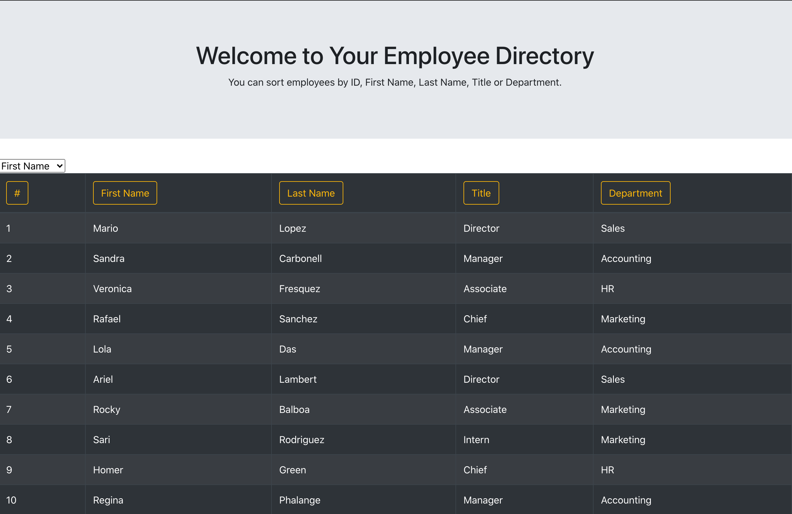

# React-Employee-Directory

This application was created with React.js: https://limitless-wildwood-27296.herokuapp.com/

## User Story

As a user, I want to be able to view my entire employee directory at once so that I have quick access to their information.

GIVEN I want to see a full list of my employees,

WHEN I open the application,
THEN a full list of employees is displayed

WHEN I select a field from the dropdown menu,
THEN I am able to sort my employees by first name, last name, title or department

